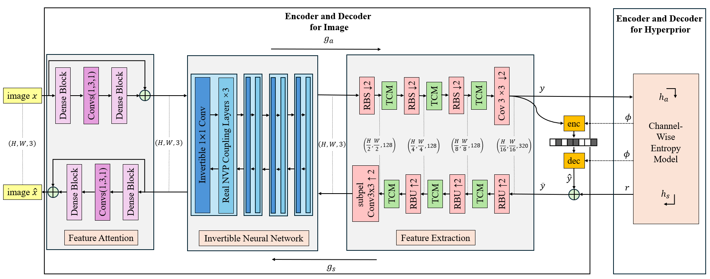
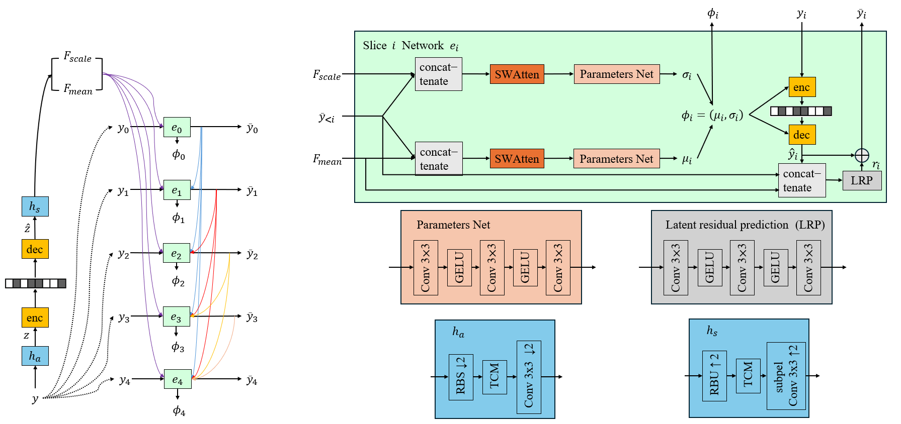
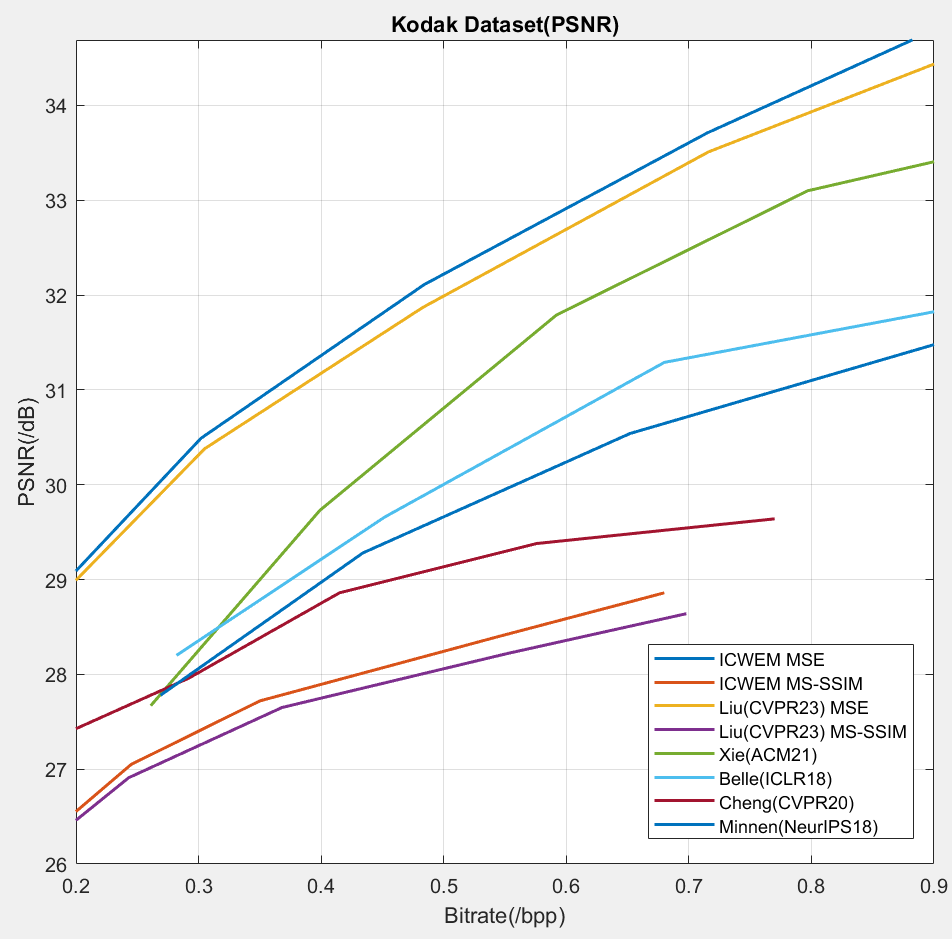
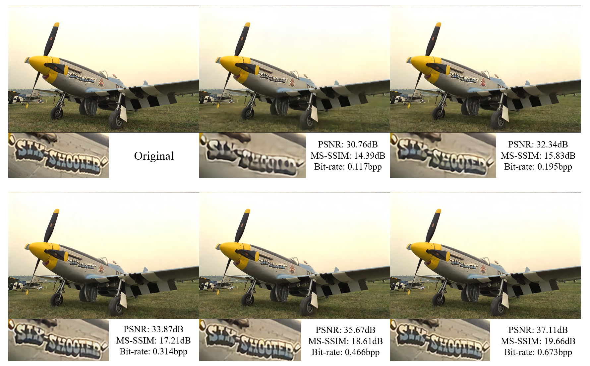

# ICWEM: Invertible Channel-Wise Entropy Model for Image Compression
Junsong Liao, *Imperial College London, United Kingdom*

This is the pytorch version of the implementation of the MSc individual research project at Imperial College London. 

Please feel free to contact Junsong Liao ([jl8323@ic.ac.uk](jl8323@ic.ac.uk)) if you have any questions.

This code is based on the work of [Learned Image Compression with Mixed Transformer-CNN Architectures](https://openaccess.thecvf.com/content/CVPR2023/papers/Liu_Learned_Image_Compression_With_Mixed_Transformer-CNN_Architectures_CVPR_2023_paper.pdf) and [Enhanced Invertible Encoding for Learned Image Compression](https://dl.acm.org/doi/10.1145/3474085.3475213)

Abstract
----------
Compared with traditional image compression methods, deep learning-based image compression methods have achieved better performance in rate-distortion. At present, the mainstream research directions of image compression based on deep learning are how to design a more effective transformation to convert the original image into the latent representation and how to design a more accurate entropy model in the hyperprior. In order to break through the limit of the existing image compression rate-distortion performance, we focus on these two directions above and propose an invertible channel-wise entropy model to achieve better image compression. For the first direction, we introduce the Invertible Neural Network to adjust image probability distribution for more efficient feature extraction and entropy coding, add the Feature Attention Module to enhance this process and use the Transformer-CNN Module to extract the local and non-local information efficiently. For the second direction, we adopt the state-of-the-art channel-wise entropy model with Transformer-CNN Module and SWAtten Module. The ablation experiments show that these modules mentioned above are all able to improve the performance of rate-distortion. The results on the Kodak dataset, CLIC 2021 dataset and Tecnick dataset indicate that our model outperforms the current existing state-of-the-art image compression model on our training parameters.

ICWEM: Invertible Channel-Wise Entropy Model
----------



Result
----------


Visual Result
----------


Installation
----------
Please first prepare a virtual environment and run `pip install -r requirements.txt`.

The version in `requirements.txt ` can be changed according to your pytorch and cuda version.

But there is a very important package: compressai.

If you find errors when run `pip install compressai`, please change a system or computer.

If you find that the Python files and CPP files in the compressai package are incompatible, this is because the local compressai folder after downloading conflicts with the compressai package. Please delete the local compressai folder.

Train this Model
----------
``` 
python -u ./train.py -d your_dataset \
    --cuda --N 128 --lambda 0.05 --epochs 400 --lr_epoch 45 48 \
    --save_path train_result --save
``` 

Evaluate this Model
----------
If you only want to get the overall data of the test dataset, please use:
``` 
python eval.py --checkpoint [path of the pretrained checkpoint] --data test_dataset --cuda
``` 

If you want to get the data for each image in the test dataset and save the compressed images, please use:
``` 
python test.py --checkpoint [path of the pretrained checkpoint] --data test_dataset --cuda
``` 
and change the save path in line 160 in the test.py.

## Pretrained Model
| Lambda | Metric | Link |
|--------|--------|--------|
|  0.0035   | MSE     |   [link](https://drive.google.com/file/d/1vYeBYvD2nkEjdSCzzCLN-a7t51LXtOSB/view?usp=drive_link) |
|  0.0067   | MSE     |   [link](https://drive.google.com/file/d/1ohBliTCRnG2h46WfjENWAX6L2If2uJxn/view?usp=drive_link) |
|  0.013    | MSE     |   [link](https://drive.google.com/file/d/12WEMBwh4ppWBqCgGpPhDvixoIio9U328/view?usp=drive_link) |
|  0.025    | MSE     |   [link](https://drive.google.com/file/d/16s6m2c96kkwqaHHzln5tZ9lCe6YzRbJl/view?usp=drive_link) |
|  0.05     | MSE     |   [link](https://drive.google.com/file/d/1uyKcq-ynXs0txh8aKWy3wWCrm4JNr-Eq/view?usp=drive_link) |
|  3        | MS-SSIM |   [link](https://drive.google.com/file/d/1f2xtTxKvokSBDXrZ8ydqMDfHCrfzIZ1-/view?usp=drive_link) |
|  8        | MS-SSIM |   [link](https://drive.google.com/file/d/1qiVfT2CPcRpnIlipGYmXZ80e-HLCnGgx/view?usp=drive_link) |
|  16       | MS-SSIM |   [link](https://drive.google.com/file/d/19WUk1OmgL4kjXt6eDV9Ls2bC-NWJSKXW/view?usp=drive_link) |
|  36       | MS-SSIM |   [link](https://drive.google.com/file/d/1YLnVDvg5xTMaK5kGU_qMtvClGa1S6sdk/view?usp=drive_link) |
|  64       | MS-SSIM |   [link](https://drive.google.com/file/d/1eeOGo3usTSHfMt5SvFR7-krdlq6Ia0TX/view?usp=drive_link) |

## Related Works
https://github.com/InterDigitalInc/CompressAI

https://github.com/xyq7/InvCompress

https://github.com/jmliu206/LIC_TCM

Citation
----------
```BibTex
@mastersthesis{liao2024invertible,
  author={Junsong Liao},
  title={{Invertible Channel-Wise Entropy Model}},
  school={Imperial College London},
  year={2024}
}
```
